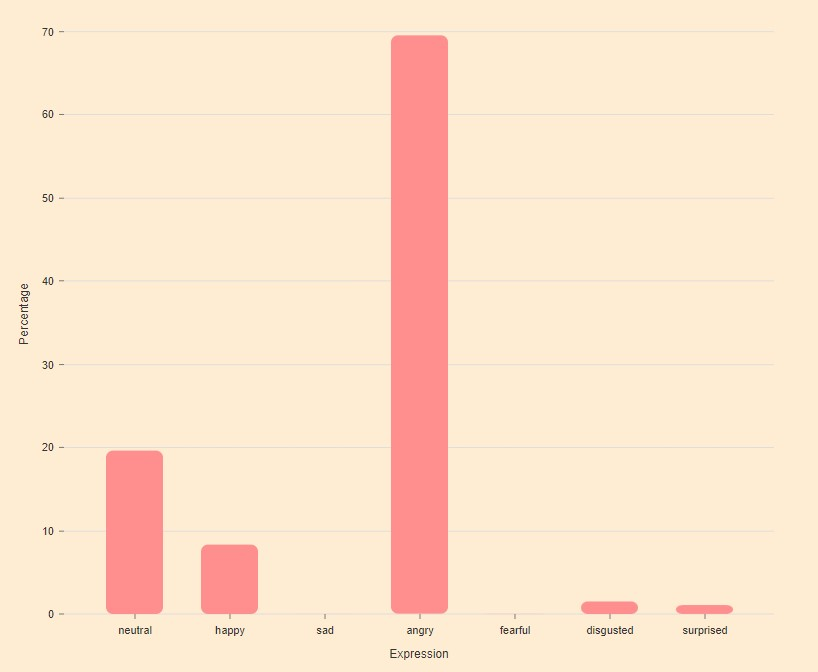
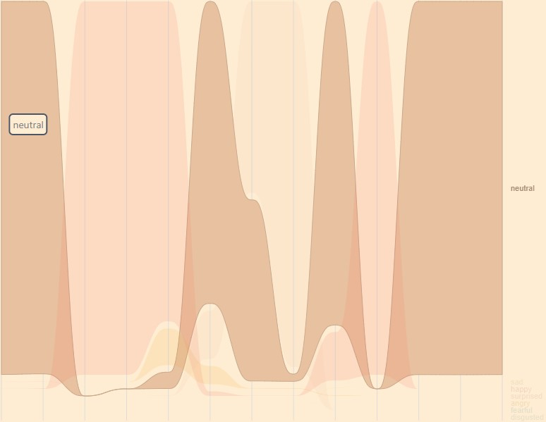
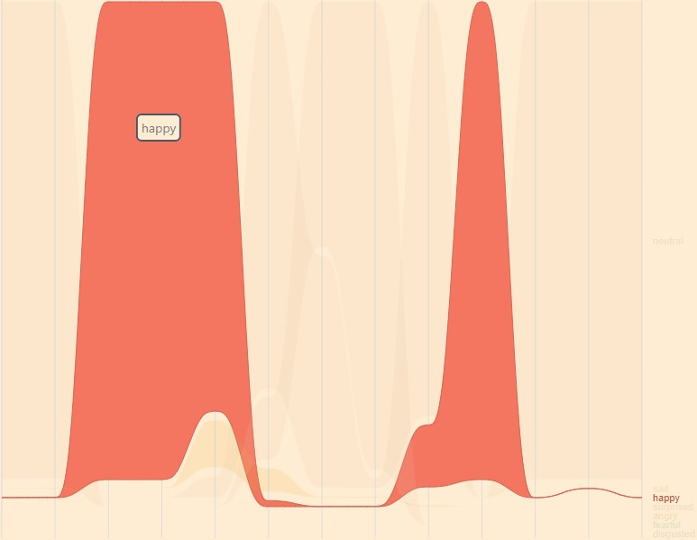
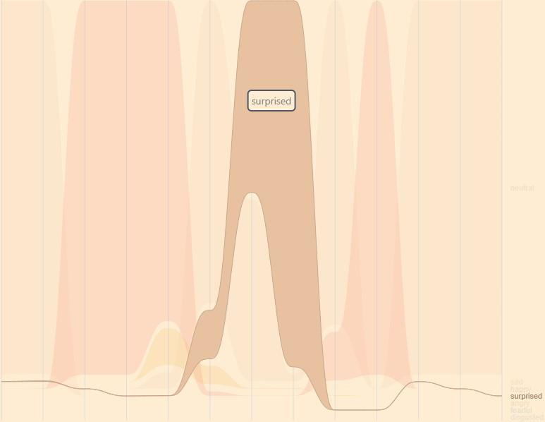

<h1 align="center">
    
    <a href="https://face-emotion-recognition.netlify.app">
        <span valign="middle">
                Face Emotion Recognition
        </span>
    </a>
</h1>

Recognizes the faces, and expressions of the faces in real-time, from the video stream.

🚀 Live App: https://face-emotion-recognition.netlify.app

Made using: [React](https://reactjs.org), [face-api.js](https://github.com/justadudewhohacks/face-api.js/), [Tailwind CSS](https://tailwindcss.com/), [Framer Motion](https://www.framer.com/motion/)

## Features

### Real Time Emotion Recogntion


- Detects the faces from the Video Stream.
- Recognizes the facial landmarks.
- Hence predicts the facial expression from the landmarks.

### Overall Emotion Analysis


While the webcam is on, the expressions detected will be recorded.
When the webcam is turned off (for example when the video call is completed), the recorded expressions will be plotted on a Area Chart.





- This is an interactive Area Chart, it is also downloadable :)
- This analysis helps teacher, analyse the student's expressions, mood for one whole video call.

### Design
- Chosen React's ContextAPI over Redux (as this app has a small state, which could be managed by ContextAPI)
- Used TailwindCSS as it has utility classes, which makes styling easier.
- Used FramerMotion for all those smooth animations.
- This webapp does the face detection, face emotion detection in the frontend using the npm package face-api.js.
    - Gave a thought about integrating face-api.js into backend using NodeJS
        - In this case we have to take a photo of webcam 2 or 3 times a second.
        - Do a POST request to the server, which returns the detections.
        - Then draw or show the detections in the chart and canvas (VideoStreamOverlay).
        - But, this has a problem - **Network Speed**
        - If the Network Speed of the student is slow, the webapp will not be showing emotions instantly, as the photos will not be sent to server instantly.
        - Also we should be recording the expressions of the student, if the Network Speed is slow this isn't feasible.
        - So I avoided this way :)
    - Integrating face-api.js into the frontend seemed a good option, as it detects the faces, landmarks instantly.
        - Webapp loads Home page instanly, shows whats going on (Eg: Shows message "Loading Models ..." when downloading the ML Models), instead of showing a blank white page.
        - Once the webapp has loaded all of its models, it can function even with no internet, as the models are already downloaded.
        - So, even the student has less Network Speed, as it dowsn't depend on it, the webapp detects the face, landmarks and records expressions instatly.
        - This too has a tradeoff - **User Experience**
        - The user interactions, animations are lagging due to the processing involved in the frontend.
        - This lagging is significantly observed on mobile devices.
        - This problem is found when the website is deployed, there is no problem when tested on local server.
        - I have chosen this way beacuse this webapp is not primarily made for mobile devices.
- Used [react-router-dom](https://reactrouter.com/), as it supports Lazy Loading of components.
    - Actually this project just has one page: Dashboard
    - But just after the Dashboard component loads, it needs to load the ML Models which are of nearly 6mb.
    - Until the Models are loaded, the page will not work, giving user a bad impression.
    - So I added a new Home page which is lightweight, loads instantly, doesn't keep the user waiting with a blank white screen.
    - When the user clicks on the "Run" button, the models will be loaded, then the Dashboard page is loaded.
- Used [react-webcam](https://github.com/mozmorris/react-webcam), for the webcam integration.
- Used [html2canvas](https://github.com/niklasvh/html2canvas), [jspdf](https://github.com/parallax/jsPDF) for rendering the OverallEmotionAnalysis Chart to PDF.

### Regrets
- I should have used Typescript instead of Javascript
    - When the project is small, I haven't faced any problem in autocompletion, definitions, etc ...
    - As the project grew, the autocompletion has gone especially on variables of object type. I used to go back to the file where the variable is defined, and used to check its properties ;(


### To run on local server
```bash
> git clone https://github.com/Eessh/face-emotion-recognition.git
> cd face-emotion-recognition
> npm install
> npm run start
```
There you have it 🙌
