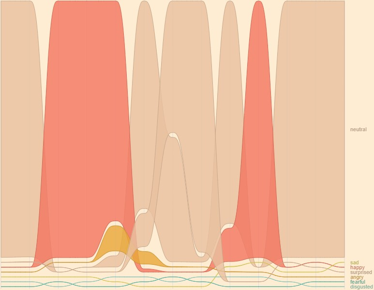

<h1 align="center">
    
    <a href="https://face-emotion-recognition.netlify.app">
        <span valign="middle">
                Face Emotion Recognition
        </span>
    </a>
</h1>

Recognizes the faces, and expressions of the faces in real-time, from the video stream.

🚀 Live App: https://face-emotion-recognition.netlify.app

Made using: [React](https://reactjs.org), [face-api.js](https://github.com/justadudewhohacks/face-api.js/), [Tailwind CSS](https://tailwindcss.com/), [Framer Motion](https://www.framer.com/motion/)

## Features

### Real Time Emotion Recogntion


- Detects the faces from the Video Stream.
- Recognizes the facial landmarks.
- Hence predicts the facial expression from the landmarks.

### Overall Emotion Analysis


While the webcam is on, the expressions detected will be recorded.
When the webcam is turned off (for example when the video call is completed), the recorded expressions will be plotted on a Area Chart.


- This is an interactive Area Chart, it is also downloadable :)
- This analysis helps teacher, analyse the student's expressions, mood for one whole video call.

### Design
- Chosen React's ContextAPI over Redux (as this app has a small state, which could be managed by ContextAPI)
- Used TailwindCSS to get ease with CSS.
- Used FramerMotion for all those smooth animations.
- This webapp does the face detection, face emotion detection in the frontend.

### Regrets
- I should have chosen to do all the heavy processing in the backend
    - Reason: The heavy work done when recognizing the faces, emotions is slowing down the browser. This problem is found when the website is deployed, there is no problem when tested on local server.


### To run on local server
```bash
> git clone https://github.com/Eessh/face-emotion-recognition.git
> cd face-emotion-recognition
> npm install
> npm run start
```
There you have it 🙌
